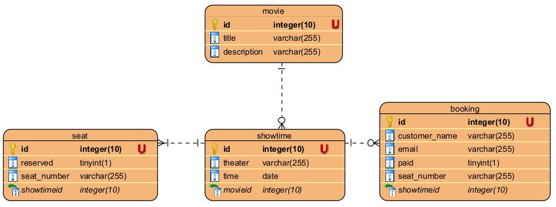

# 📊 Phân Tích và Thiết Kế Hệ Thống Đặt Vé Xem Phim

## 1. 🎯 Mô Tả Vấn Đề

Hệ thống đặt vé xem phim trực tuyến giải quyết nhu cầu đặt vé nhanh chóng, thuận tiện và tránh các vấn đề thường gặp khi đặt vé truyền thống như xếp hàng, hết vé, hay xung đột khi đặt chỗ.

**Người dùng:**
- Khách hàng tìm kiếm và đặt vé xem phim
- Nhân viên rạp phim quản lý suất chiếu và ghế
- Quản trị viên hệ thống giám sát hoạt động

**Mục tiêu chính:**
- Cung cấp trải nghiệm đặt vé trực tuyến mượt mà, dễ sử dụng
- Đảm bảo tính nhất quán khi nhiều người cùng đặt vé một lúc
- Quản lý hiệu quả thông tin phim, lịch chiếu và ghế ngồi
- Xử lý thanh toán an toàn và gửi thông tin xác nhận đặt vé

**Dữ liệu xử lý:**
- Thông tin phim (tên, mô tả, thời lượng, ...)
- Lịch chiếu (thời gian, rạp, phòng chiếu)
- Thông tin ghế (vị trí, trạng thái)
- Dữ liệu đặt vé (thông tin khách hàng, ghế đã chọn, trạng thái thanh toán)

## 2. 🧩 Các Microservices Đã Xác Định

| Tên Service     | Trách Nhiệm                                          | Stack Công Nghệ                      |
|-----------------|------------------------------------------------------|------------------------------------|
| Movie Service   | Quản lý thông tin phim và lịch chiếu                | Spring Boot, MySQL, Eureka Client  |
| Seat Service    | Quản lý thông tin ghế và trạng thái đặt chỗ         | Spring Boot, MySQL, Redis, RabbitMQ, Eureka Client |
| Booking Service | Xử lý đặt vé, thanh toán và gửi email               | Spring Boot, MySQL, Redis, RabbitMQ, Feign Client, Eureka Client |
| API Gateway     | Điều hướng yêu cầu, xác thực và ủy quyền            | Spring Cloud Gateway, JWT          |
| Eureka Server   | Service discovery                                   | Spring Cloud Netflix Eureka        |

## 3. 🔄 Giao Tiếp Giữa Các Service

### Giao Tiếp Đồng Bộ (REST API):
- Gateway ⟷ Tất cả các service (REST)
- Booking Service ⟷ Movie Service: Lấy thông tin phim và lịch chiếu qua Feign Client
- Booking Service ⟷ Seat Service: Kiểm tra và đặt ghế qua Feign Client

### Giao Tiếp Bất Đồng Bộ (Message Queue):
- Booking Service → Seat Service: Thông báo kết quả thanh toán qua RabbitMQ để cập nhật trạng thái ghế
- Booking Service → Email Service: Gửi email xác nhận đặt vé qua RabbitMQ

## 4. 🗂️ Thiết Kế Dữ Liệu

### Movie Service:
- **Movie**: id, title, description, showtimes
- **Showtime**: id, time, theater, movie_id

### Seat Service:
- **Seat**: id, seat_number, reserved, showtime_id
- **Redis**: Lưu trữ trạng thái tạm thời của ghế với khóa "seat:{showtimeId}:{seatNumber}"

### Booking Service:
- **Booking**: id, showtime_id, seat_number, customer_name, email, paid, created_at, updated_at



## 5. 🔐 Vấn Đề Bảo Mật
- Sử dụng JWT cho xác thực và phân quyền tại API Gateway
- Mã hóa thông tin thanh toán trong quá trình truyền và lưu trữ
- Bảo vệ API với Rate Limiting để ngăn chặn tấn công DDoS
- Sử dụng HTTPS cho tất cả các kết nối
- Áp dụng Principle of Least Privilege cho mỗi service

## 6. 📦 Kế Hoạch Triển Khai
- Mỗi service được container hóa bằng Docker với Dockerfile riêng
- Sử dụng Docker Compose để quản lý tất cả các container và phụ thuộc
- Cấu hình môi trường thông qua biến môi trường trong Docker Compose
- Sử dụng named volumes để duy trì dữ liệu MySQL, Redis và RabbitMQ
- Tất cả các service đăng ký với Eureka Server để service discovery

## 7. 🎨 Sơ Đồ Kiến Trúc

```
+---------------+          +---------------+          +---------------+
|               |          |               |          |               |
|  Movie DB     |◀---------| Movie Service |----------| API Gateway   |
|               |          |               |          |               |
+---------------+          +---------------+          +-------▲-------+
                                                             |
                                                             |
+---------------+          +---------------+          +------▼--------+
|               |          |               |          |               |
|  Seat DB      |◀---------| Seat Service  |◀---------| Eureka Server |
|               |          |               |          |               |
+---------------+          +-------▲-------+          +---------------+
                                   |
                                   |
+---------------+          +-------▼-------+          +---------------+
|               |          |               |          |               |
| Booking DB    |◀---------| Booking       |----------| Redis         |
|               |          | Service       |          |               |
+---------------+          +-------▲-------+          +---------------+
                                   |
                                   |
                           +-------▼-------+
                           |               |
                           | RabbitMQ      |
                           |               |
                           +---------------+
```

## 8. ✅ Các Điểm Mạnh của Kiến Trúc

- **Khả năng mở rộng**: Mỗi service có thể được mở rộng độc lập dựa trên nhu cầu.
- **Tính module**: Các service được phát triển, triển khai và bảo trì độc lập.
- **Khả năng chịu lỗi**: Sử dụng Circuit Breaker để ngăn lỗi cascading, đảm bảo một service bị lỗi không làm sập toàn bộ hệ thống.
- **Xử lý đồng thời**: Sử dụng Redis để khóa ghế tạm thời, ngăn chặn việc đặt trùng ghế.
- **Xử lý bất đồng bộ**: Sử dụng RabbitMQ để xử lý các tác vụ không yêu cầu phản hồi tức thì như gửi email.
- **Service discovery**: Eureka Server giúp các service dễ dàng tìm thấy nhau mà không cần cấu hình cứng.
- **API Gateway tập trung**: Cung cấp một điểm vào duy nhất, giúp đơn giản hóa bảo mật và giám sát.

Kiến trúc này phù hợp cho hệ thống đặt vé xem phim vì nó đáp ứng được các yêu cầu về khả năng mở rộng, độ tin cậy và tính linh hoạt, đồng thời giải quyết các thách thức như xử lý đồng thời và nhất quán dữ liệu trong môi trường phân tán.
