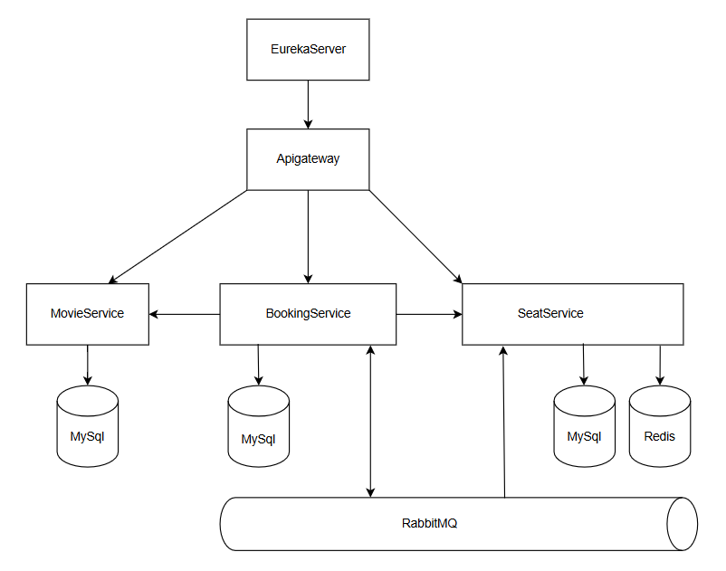

# Kiến Trúc Hệ Thống Đặt Vé Xem Phim

## Tổng Quan
### Mục đích
Hệ thống đặt vé xem phim của nhóm được thiết kế dựa trên kiến trúc microservices, mang đến trải nghiệm mượt mà và tiện lợi cho người dùng trong việc tìm kiếm, lựa chọn phim, xem lịch chiếu, đặt vé và thanh toán trực tuyến. Kiến trúc này được xây dựng với mục tiêu tối ưu hóa tính module hóa, cho phép mỗi dịch vụ hoạt động độc lập, từ quản lý danh mục phim, lịch chiếu, đặt chỗ, đến xử lý thanh toán. Nhờ vậy, hệ thống không chỉ đảm bảo khả năng mở rộng linh hoạt để đáp ứng nhu cầu tăng trưởng của người dùng, mà còn hỗ trợ phát triển và bảo trì từng dịch vụ riêng lẻ mà không ảnh hưởng đến toàn bộ hệ thống. Điều này giúp nâng cao hiệu suất, giảm thiểu rủi ro lỗi hệ thống, và cho phép tích hợp các tính năng mới một cách nhanh chóng và hiệu quả.
### Các thành phần chính
Hệ thống bao gồm các microservices chính như API Gateway, Eureka Server, Movie Service, Seat Service và Booking Service, phối hợp để tạo nên quy trình đặt vé liền mạch. Các dịch vụ này giao tiếp với nhau thông qua API và RabbitMQ, tận dụng hàng đợi tin nhắn để xử lý bất đồng bộ, đảm bảo tính độc lập và hiệu suất cao.

## Thành Phần Hệ Thống
- **API Gateway**: Đóng vai trò là cổng vào duy nhất của hệ thống, xử lý việc định tuyến các yêu cầu đến các dịch vụ phù hợp, xác thực JWT và bảo mật.
- **Eureka Server**: Dịch vụ phát hiện (service discovery) cho phép các microservices đăng ký và tìm kiếm lẫn nhau.
- **Movie Service**: Quản lý thông tin về phim và lịch chiếu phim (showtimes).
- **Seat Service**: Quản lý thông tin về ghế và trạng thái đặt chỗ.
- **Booking Service**: Xử lý quy trình đặt vé, thanh toán và gửi email xác nhận.

## Giao Tiếp
Các dịch vụ giao tiếp với nhau thông qua hai phương thức chính:
- **REST API (Đồng bộ)**: Sử dụng Feign Client để gọi API giữa các dịch vụ, truyền dữ liệu định dạng JSON. Phương thức này được dùng cho các tác vụ cần phản hồi tức thời, như truy vấn thông tin phim hoặc trạng thái ghế.
- **RabbitMQ (Bất đồng bộ)**: Sử dụng hàng đợi tin nhắn để xử lý giao tiếp bất đồng bộ (gửi email, cập nhật trạng thái ghế).
Mạng nội bộ được thiết lập thông qua Docker Compose, cho phép các dịch vụ giao tiếp bằng tên service(ví dụ: movie-service, seat-service, booking-service).

## Luồng Dữ Liệu
1. **Tìm Kiếm và Chọn Phim**:
    - Người dùng truy cập hệ thống thông qua API Gateway
    - API Gateway định tuyến yêu cầu đến Movie Service
    - Movie Service trả về danh sách phim và lịch chiếu

2. **Đặt Vé**:
    - Người dùng chọn ghế còn trống của lịch chiếu qua Seat Service
    - Seat Service sử dụng Redis để khóa ghế tạm thời
    - Booking Service tạo đơn đặt vé và xử lý thanh toán
    - Khi thanh toán thành công, Booking Service gửi tin nhắn qua RabbitMQ đến Seat Service để cập nhật trạng thái ghế
    - Booking Service gửi email xác nhận thông qua hàng đợi RabbitMQ

3. **Xử Lý Đơn Đặt Vé Hết Hạn**:
    - Scheduled task định kỳ kiểm tra các đơn đặt vé chưa thanh toán
    - Nếu quá thời gian quy định (10 phút), hệ thống tự động hủy đơn và giải phóng ghế

## Sơ Đồ Kiến Trúc
Sơ đồ được lưu tại : docs/asset/high-level architecture diagram.png

## Khả Năng Mở Rộng & Khả Năng Chịu Lỗi
- **Tính Mở Rộng Theo Chiều Ngang**: Mỗi dịch vụ có thể được mở rộng độc lập bằng cách triển khai nhiều phiên bản.
- **Circuit Breaker**: Sử dụng Resilience4j để xử lý khi dịch vụ không khả dụng.
- **Rate Limiting**: Bảo vệ API khỏi quá tải.
- **Distributed Locking**: Sử dụng Redis để xử lý đồng thời việc đặt ghế.
- **Message Queueing**: Sử dụng RabbitMQ để đảm bảo tin nhắn không bị mất khi dịch vụ tạm thời không khả dụng.

## Cơ Sở Dữ Liệu
- Mỗi dịch vụ có mô hình dữ liệu riêng phù hợp với trách nhiệm của nó
- Sử dụng MySQL làm cơ sở dữ liệu chính
- Redis làm cache và lock manager
